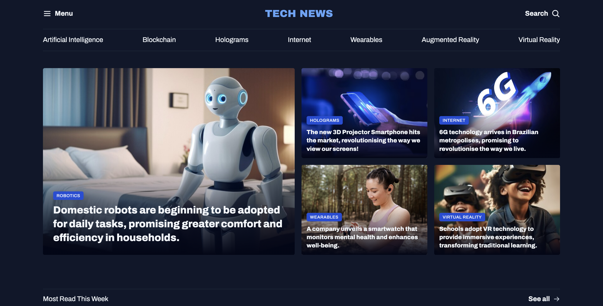

# Project - News Portal 2025

Welcome to **Project News Portal**, a modern and user-friendly platform designed to deliver news efficiently and effectively.



🌐 [Live Demo](https://rodrigovaladao.github.io/project-news-portal/)

## Features

- **Latest News Updates:** Stay informed with up-to-date news articles.
- **Category Browsing:** Easily navigate through different news categories.

## Technologies Used

- **HTML5:** Structure of the website.
- **CSS3:** Styling for a visually appealing interface.

## Installation

To run this project locally:

1. Clone the repository:
   ```bash
   git clone https://github.com/rodrigovaladao/project-news-portal.git
   ```
